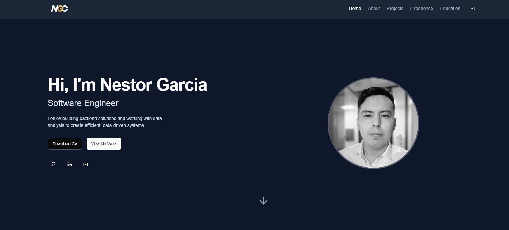
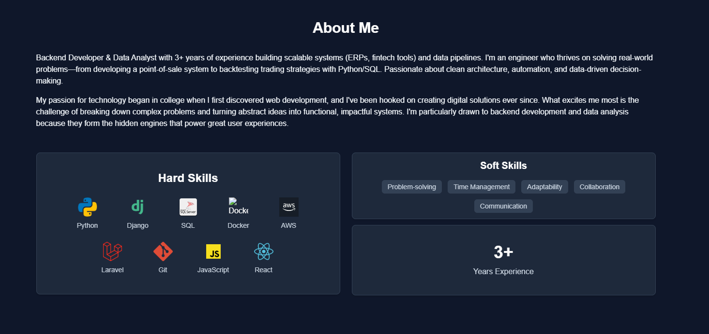
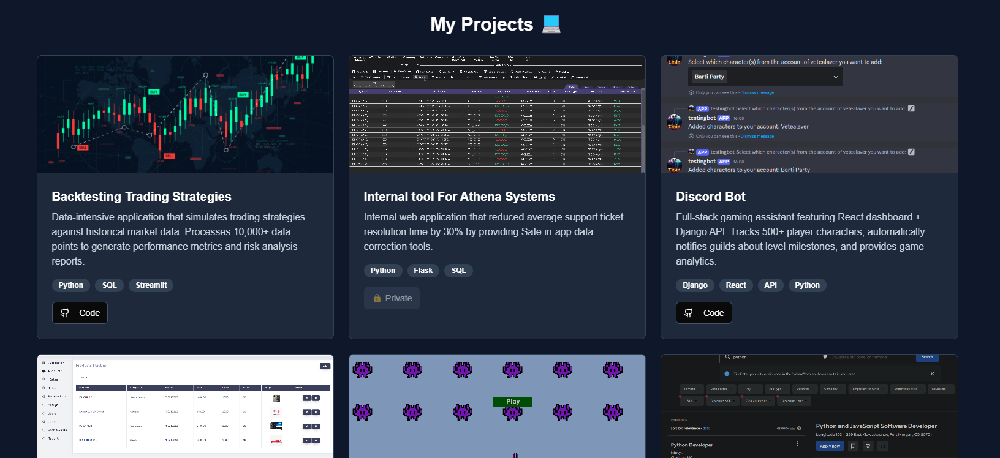

# 🧑‍💻 Nestor Garcia — Portfolio

Welcome to my personal software engineering portfolio, built with **Next.js**, **Tailwind CSS**, and the **App Router**.  
It showcases my projects, experience, skills, and contact information — all in a clean and modern interface.

---

## 🚀 Live Site

🔗 [https://nestorgarcia.vercel.app/](https://nestorgarcia.vercel.app/)

---

## 📸 Screenshots

### 💻 Home Page



### 🧠 About + Skills



### 🧾 Projects



---

## 🛠 Tech Stack

- **Framework:** [Next.js 13+](https://nextjs.org/)
- **Styling:** [Tailwind CSS](https://tailwindcss.com/)
- **Icons:** [Lucide Icons](https://lucide.dev/)
- **Deployment:** [Vercel](https://vercel.com/)
- **Language:** TypeScript

---

## 📁 Features

- Responsive, dark mode-ready layout ✨
- Sections: About, Skills, Projects, Experience, Education, Contact
- Smooth scroll + active nav highlight
- SEO optimized head configuration
- Modular components for easy scaling

---

## 🚧 Setup Instructions

```bash
git clone https://github.com/Nesgc/Portfolio.git
cd Portfolio
npm install
npm run dev
```
